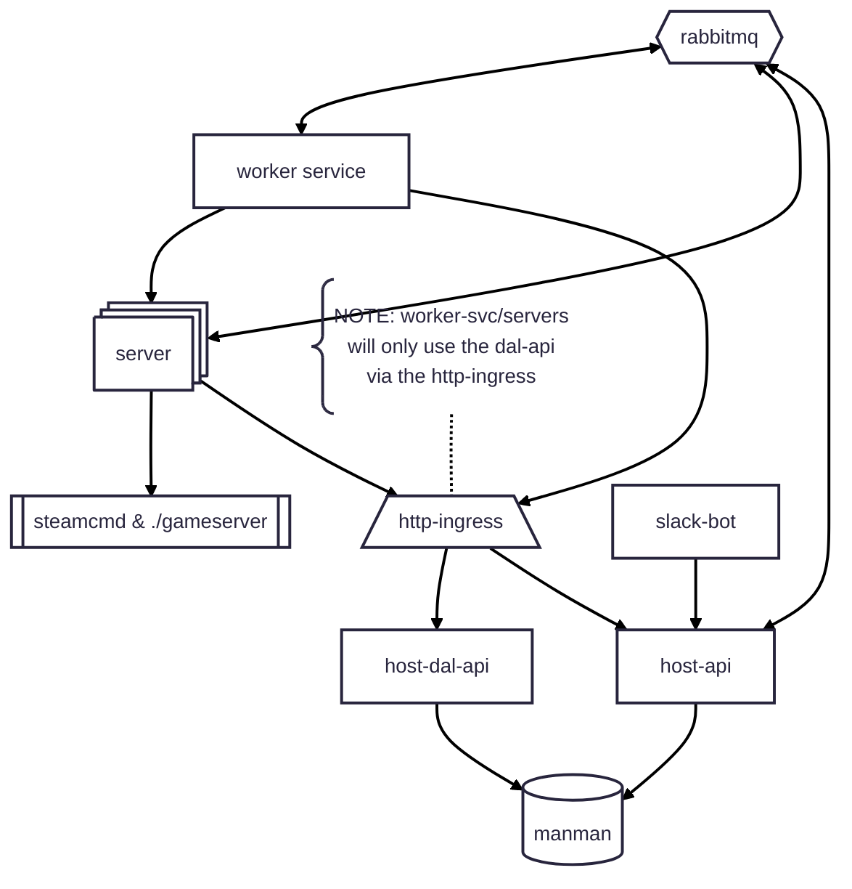

# manman
([cs2/game]server)man(ager)man(ager)


## about

successor of https://github.com/whale-net/cs-server-runner

more cloud friendly

hopefully better patterns

easier deployment (maybe?)

fun fact: according to https://en.wiktionary.org/wiki/manman, manman is mother in haitian creole, and is the act of observing in tagalog
this project is the mother and observer to all the little workers

architecture


### features

- runs servers in server manager service (manman-worker)
    - exposes management API (install/start/shutdown/sendcommand)
    - single process manages one-or-many servers
        - easier to run outside of managed ($$$) environments
        - only runs outside managed environments (for now?)
- server manager service manager (manman-host)
    - controls server manager service instances
    - exposes management API (worker/info/admin)

### not in this repo
~~UI - this will live in https://github.com/whale-net/orca project~~


going to try and expose via slack instead. Don't want to have to maintain a javascript ui.


## setup

this is uv project. install using the following commands:
```bash
uv venv
source .venv/bin/activate
uv sync
```


### running locally

Put env vars into `.env` file.
This is not required for running tilt, as tilt will autoload them.
These can be exported using the following command:
```bash
export $(cat .env | xargs)
```

Host can be started with Tilt
```bash
tilt up
```

or done manually.
The manual approach is handy for creating and running migrations
```bash
uv run host start
```

start the worker
```bash
uv run worker start
```
